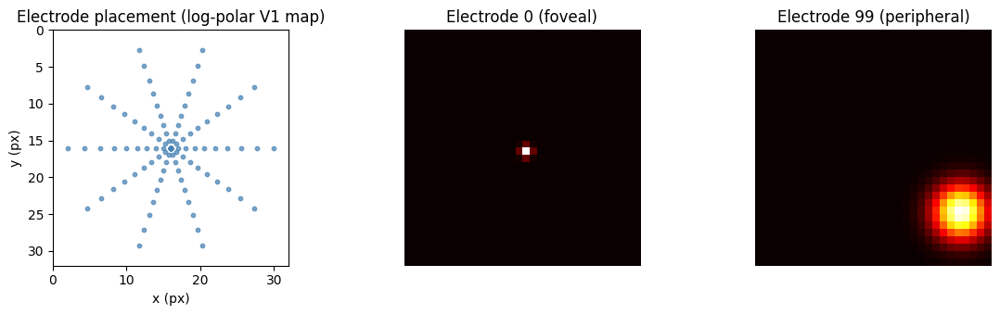
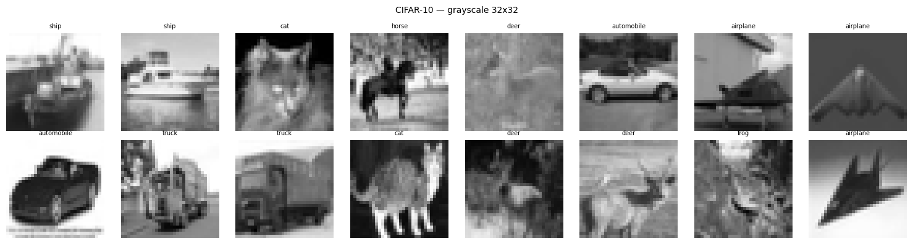
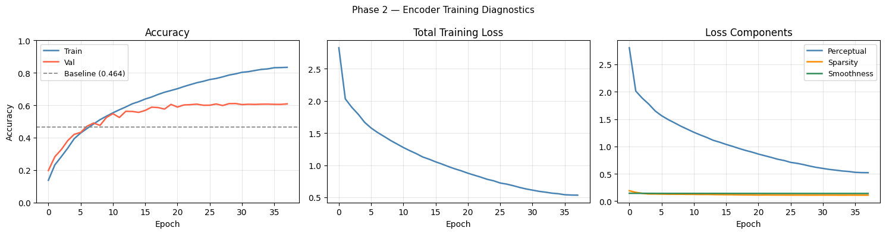
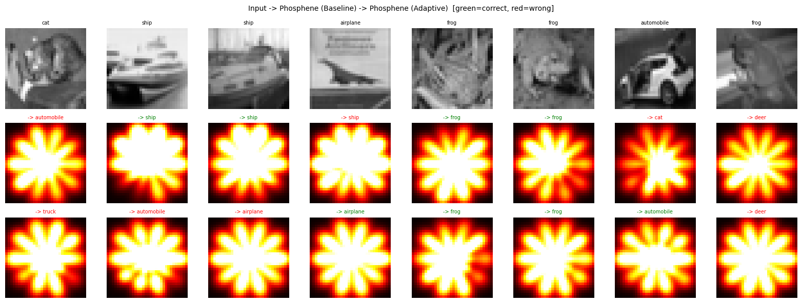
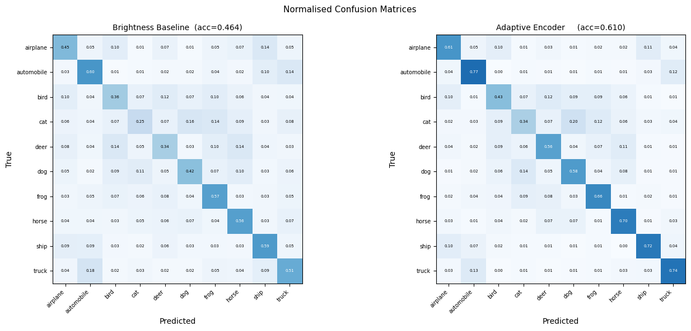
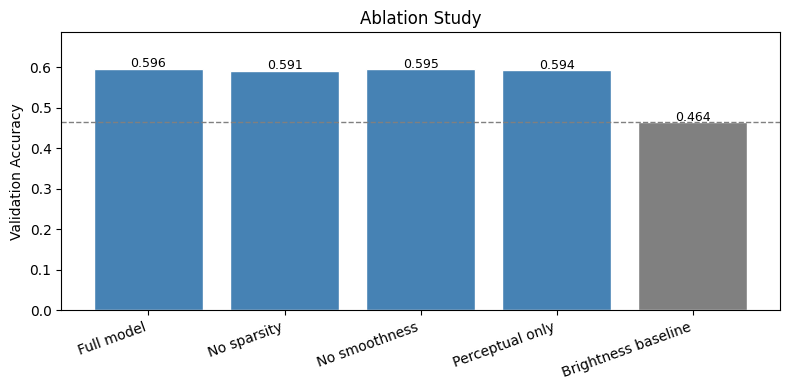
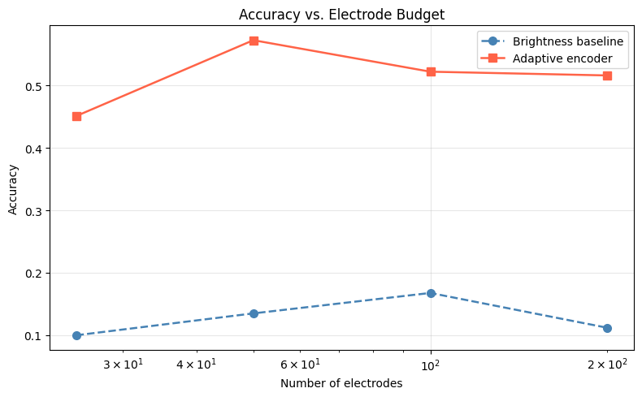

# Adaptive Phosphene Encoding via Learned Stimulus Optimisation

**Paper 3 in the Cortical Visual Prosthetics Series**

[](https://colab.research.google.com/github/abdullashahzan/paper3-phosphene-encoder/blob/main/paper3_adaptive_encoder_colab.ipynb)


**Author:** Shahzan Abdulla  
**Affiliation:** Department of Computer Engineering, King Khalid University, Abha, Saudi Arabia  
**Contact:** abdullashahzan@gmail.com · [LinkedIn](https://linkedin.com/in/abdullashahzan)

---

## Overview

Classical cortical visual prosthetics map electrode activations directly from image brightness — a hand-crafted heuristic with no learning mechanism. This repository contains the full implementation of **Paper 3**, which replaces brightness mapping with a convolutional neural network trained end-to-end through a frozen biologically plausible V1 simulator and a domain-aligned perceptual oracle.

### The Core Result

| Method | Accuracy | Macro F1 |
|--------|----------|----------|
| Brightness Baseline | 46.4% | 0.458 |
| **Adaptive Encoder (ours)** | **61.0%** | **0.606** |
| **Improvement** | **+14.6pp** | **+0.148** |

The adaptive encoder at **50 electrodes** outperforms brightness mapping at **200 electrodes** by 46 percentage points — with direct implications for surgical risk and implant power consumption.

---

## The Three-Paper Series

This paper is part of a series building toward practical cortical prosthetics:

| Paper | Title | Contribution |
|-------|-------|--------------|
| [Paper 1](https://github.com/abdullashahzan/phosphene-transfer-learning-bionic-eye) | Transfer Learning for Phosphene-Based Object Recognition | EfficientNet-B0 recognition of phosphene images; transfer learning dynamics analysis |
| [Paper 2](https://github.com/abdullashahzan/phosphene-simulation-bionic-eye) | Biologically Plausible Differentiable Phosphene Simulator | V1 simulator with log-polar retinotopy, eccentricity-dependent phosphene sizing, electrode dropout |
| **Paper 3 (this repo)** | Adaptive Phosphene Encoding | End-to-end learned encoder trained through frozen simulator + oracle |

### Pipeline

```
Camera Image  →  Encoder (learned)  →  Simulator (Paper 1, frozen)  →  Phosphene  →  Oracle (Paper 2, frozen)  →  Loss
    32×32         100 activations          Gaussian basis                  image         Cross-entropy            ↓
                      [0,1]               log-polar V1 map                                                   backprop to
                                                                                                             encoder only
```

---

## Repository Structure

```
paper3-phosphene-encoder/
│
├── paper3_adaptive_encoder_colab.ipynb   # Main notebook — run this in Colab
├── paper3.pdf                            # The research paper
├── paper3_explanation.pdf                # Plain-language guide to everything in Paper 3
│
├── figures/
│   ├── electrode_layout.png              # Fig 1 — V1 electrode placement + basis functions
│   ├── data_samples.png                  # CIFAR-10 grayscale samples
│   ├── training_curves.png               # Fig 2 — Phase 2 training diagnostics
│   ├── visual_comparison.png             # Fig 3 — Baseline vs adaptive phosphenes
│   ├── confusion_matrices.png            # Fig 4 — Per-class confusion matrices
│   ├── ablation_study.png                # Fig 5 — Loss term ablation
│   └── electrode_budget.png              # Fig 6 — Accuracy vs electrode count
│
│
└── README.md
```

---

## Quickstart

### Requirements

- Google Colab free tier with **T4 GPU** (Runtime → Change runtime type → T4 GPU)
- No local installation needed — everything runs in Colab

### Run

1. Open `paper3_adaptive_encoder_colab.ipynb` in Google Colab
2. Set runtime to **T4 GPU**
3. Run all cells

Total runtime: approximately **90 minutes** (Phase 1: ~10 min, Phase 2: ~15 min, evaluation: ~65 min)

### Prevent data loss on disconnect

```python
# At the top of the notebook, set:
USE_DRIVE = True   # saves checkpoints to Google Drive after every epoch
```

---

## Method

### Phase 1 — Oracle Pretraining (Domain Alignment)

The key insight of Paper 3 is that the reward oracle must be adapted to the phosphene domain before it can train the encoder effectively. Using an ImageNet-pretrained oracle directly gives 24.1% accuracy. After domain alignment, the same encoder architecture reaches 61.0% — a **36.9 percentage point gap** caused entirely by the quality of the reward signal.

**Procedure:**
1. Generate 50,000 phosphene images from CIFAR-10 training data using the brightness baseline
2. Train EfficientNet-B0 to classify these phosphene images for 15 epochs
3. Save best checkpoint (46.4% accuracy on phosphene images)
4. Freeze oracle permanently

### Phase 2 — Encoder Training

The encoder (217,636 parameters) is the only trainable component. It learns which electrodes to activate by receiving gradients that flow backward through the frozen oracle and simulator.

**Architecture:**
```
Conv(1→32, 3×3, stride 2) + BN + GELU    →  (32, 16, 16)
Conv(32→64, 3×3, stride 2) + BN + GELU   →  (64, 8, 8)
Conv(64→128, 3×3, stride 2) + BN + GELU  →  (128, 4, 4)
GlobalAvgPool + Flatten                   →  (128,)
Linear(128→256) + GELU + Dropout(0.35)
Linear(256→256) + GELU + Dropout(0.20)
Linear(256→100) + Sigmoid                 →  100 electrode activations ∈ [0,1]
```

**Loss function:**

| Term | Formula | Clinical motivation |
|------|---------|---------------------|
| Perceptual | CrossEntropy(oracle(phosphene), label) | Phosphenes should be recognisable |
| Sparsity | \|mean(activations) − 0.30\| | Reduce charge injection (tissue safety) |
| Smoothness | Total Variation of phosphene image | Coherent phosphenes are easier to interpret |

**Training:** AdamW (lr=3e-4, wd=5e-4), one-cycle LR, gradient clipping at 1.0, early stopping patience=8

---

## Results

### Electrode Placement & Simulator

The 100 electrodes are placed on a log-polar V1 grid. Foveal electrodes (centre) produce small sharp phosphenes; peripheral electrodes produce large diffuse blobs — grounded in the Schwartz (1980) cortical magnification model.



*Fig 1 — Left: log-polar electrode placement. Centre: foveal basis function (small, sharp). Right: peripheral basis function (large, diffuse).*

---

### Training Data

CIFAR-10 converted to grayscale at 32×32 resolution to match the simulator output.



*Fig 2 — Sample CIFAR-10 images (grayscale 32×32).*

---

### Training Curves

Validation accuracy crosses the 46.4% baseline at epoch 5 and plateaus stably at ~61% from epoch 20 onward. The perceptual loss dominates by two orders of magnitude.



*Fig 3 — Phase 2 encoder training diagnostics. Left: accuracy with baseline reference. Centre: total loss. Right: loss component breakdown.*

---

### Visual Comparison

Both encoders produce the radial flower pattern imposed by the log-polar electrode geometry. The adaptive encoder differs in which petals are brighter — modulating relative electrode intensities in class-specific ways.



*Fig 4 — Input images (row 1), brightness baseline phosphenes (row 2), adaptive encoder phosphenes (row 3). Green = correct oracle prediction, red = wrong.*

---

### Confusion Matrices

The adaptive encoder improves every single class. The brightness baseline systematically confuses cats with dogs/birds (18% truck→automobile misclassification). The adaptive encoder resolves both failure modes.



*Fig 5 — Normalised confusion matrices. Brightness baseline (left, acc=0.464) vs adaptive encoder (right, acc=0.610).*

---

### Per-Class Performance

| Class | Baseline F1 | Adaptive F1 | ΔF1 |
|-------|------------|-------------|-----|
| Airplane | 0.453 | 0.611 | +0.158 |
| Automobile | 0.564 | 0.717 | +0.153 |
| Bird | 0.378 | 0.459 | +0.081 |
| Cat | 0.296 | 0.378 | +0.082 |
| Deer | 0.363 | 0.555 | **+0.192** |
| Dog | 0.446 | 0.568 | +0.122 |
| Frog | 0.515 | 0.643 | +0.128 |
| Horse | 0.523 | 0.671 | +0.148 |
| Ship | 0.551 | 0.728 | +0.177 |
| Truck | 0.490 | 0.724 | **+0.234** |
| **Macro avg** | **0.458** | **0.606** | **+0.148** |

Every single class improves. No regressions.

---

### Ablation Study

All encoder variants land within 0.6pp of each other — the perceptual loss is the primary driver. The sparsity term reduces mean electrode activation from 47.1% to 28.3% (−40%), a clinically meaningful reduction in charge injection independent of accuracy.



*Fig 6 — All encoder variants far exceed the brightness baseline. Variation among encoder configurations confirms perceptual loss dominates.*

| Configuration | Accuracy | Note |
|--------------|----------|------|
| Full model | 0.596 | |
| No sparsity | 0.591 | Mean activation stays at 47.1% |
| No smoothness | 0.595 | |
| Perceptual only | 0.594 | |
| Brightness baseline | 0.464 | — |

---

### Electrode Budget

The adaptive encoder at 50 electrodes beats brightness mapping at 200 electrodes by 46 percentage points. Since surgical risk scales with electrode count, this argues directly for clinical adoption of learned encoding.



*Fig 7 — Accuracy vs electrode count. Adaptive encoder dominates at every budget level.*

| Electrodes | Baseline | Adaptive |
|-----------|---------|---------|
| 25 | 10.0% | 45.1% |
| **50** | 13.5% | **57.2%** |
| 100 | 16.8% | 52.2% |
| 200 | 11.2% | 51.6% |

---

## Key Findings

1. **Oracle domain alignment is the primary lever.** Using an ImageNet oracle gives 24.1%. A phosphene-aware oracle gives 61.0%. The 36.9pp gap is caused entirely by reward signal quality, not encoder architecture.

2. **Learned encoding beats brightness mapping at every electrode count.** The advantage is largest at low electrode counts, where intelligent activation selection matters most.

3. **Sparsity regularisation reduces charge injection without hurting accuracy.** The sparsity term does not improve recognition performance, but reduces electrode activation by ~40% — a direct clinical safety benefit.

4. **Shape-dominant classes benefit most.** Truck (+0.234 F1), ship (+0.177), deer (+0.192) gain the most. Texture-dependent classes cat (+0.082), bird (+0.081) gain least — consistent with limited spatial resolution at 100 electrodes.

5. **50 electrodes > 200 electrodes.** The adaptive encoder with 50 electrodes outperforms brightness mapping with 200 electrodes by 46pp — directly relevant for surgical risk and implant design.

---

## Limitations

- **Not a real prosthetic system.** Everything is simulated in software. No hardware, no real electrodes, no patients.
- **Oracle as patient proxy.** The oracle grades phosphenes computationally, not by human perception. Psychophysical validation is needed.
- **Static phosphene model.** Real phosphenes fade, interact with neighbours, and change with stimulation history. Temporal dynamics are not modelled (addressed in Paper 4).
- **CIFAR-10 benchmark.** Not a clinical task. Navigation, face recognition, and text reading require different evaluation.
- **One electrode geometry.** Patient-specific V1 maps vary substantially. Personalised fine-tuning would be needed for clinical deployment.

---

## Connection to Paper 4

Paper 4 will replace the static Gaussian basis with a temporal differential equation model:

```
dI_i/dt = −I_i/τ_i + A_i·δ(t) − Σ_j w_ij·I_j
```

where τ_i is eccentricity-dependent and w_ij encodes lateral inhibition between electrode neighbours. The adaptive encoder from Paper 3 provides the warm-start initialisation for Paper 4.

---

## Citation

```bibtex
@article{abdulla2025adaptive,
  title   = {Adaptive Phosphene Encoding via Learned Stimulus Optimisation for Cortical Visual Prosthetics},
  author  = {Abdulla, Shahzan},
  journal = {Independent Research Report},
  year    = {2025},
  url     = {https://github.com/abdullashahzan/paper3-phosphene-encoder}
}
```

---

## Acknowledgements

This research is dedicated to my mother, who lost sight in her right eye following surgery — and to every patient waiting for cortical prosthetics to cross the threshold from proof-of-concept to clinical utility.

---

*Department of Computer Engineering, King Khalid University, Abha, Saudi Arabia*
